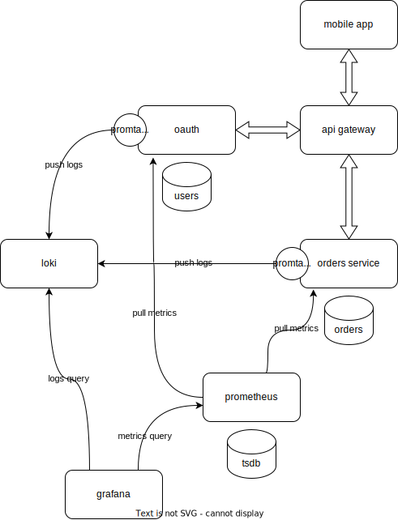
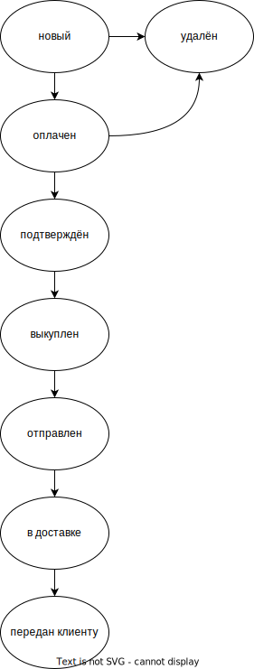

# SRS документация.

## 1. Введение

### 1.1 Приложение

+ Приложение должно поддерживать работу на Android.

+ Приложение должно иметь простой и понятный интерфейс.

+ Приложение должно иметь возможность авторизации и регистрации пользователей.

+ Приложение должно иметь возможность создания лотов на покупку товара.

+ **Цель приложения:** Приложение реализует возможность заказа различных товаров с доставкой с Dewu,
так как напрямую заказать товары с данной площадки на территорию РФ нет возможности.
Приложение осуществляет роль посредника между Dewu и пользователем.

### 1.2 Определения

- **Лот** -- товар, который попал в корзину, но ещё не оплачен.

- **Корзина** -- список всех лотов клиента. Товары из корзины можно оплатить.

- **Заказ** -- оплаченный товар.


## 2. Требования

### 2.1 Функциональные требования

#### 2.1.1 Требования к системе регистрации/авторизации

1) Система предоставляет возможность создать аккаунт всем незарегистрированным/не аутентифицированным пользователям.

2) Аутентификация доступна только зарегистрированным пользователям.

#### 2.1.2 Требования к системе заказов

1) Система должна предоставлять возможность создать лоты товара(клиент прикрепляет ссылку на товар с Dewu).

2) Система должна предоставлять возможность просмотра созданных ранее лотов(в корзине клиента).

3) Система должна предоставлять возможность выкупа/оплаты лота(товара). После этого администратор может подтвердить
выкуп товара или отменить платёж(например, если товара нет в наличии). Статус лота/товара при этом изменится
на клиентской стороне.

4) Система должна предоставлять возможность просмотра все заказов(оплаченных) пользователя.

5) Система должна предоставлять возможность удаления лотов до их оплаты из корзины.


### 2.2 Нефункциональные требования

#### 2.2.1 Поддерживаемость

1) Регистрация пользователя возможна по почте.

2) Интерфейс приложения -- русский.

#### 2.2.2 Надёжность

1) Приложение должно логгировать действия клиентов/сервера, для удобного поиска ошибок в случае их появления.

2) Приложение должно гарантировать безопасность оплаты каждым из доступных способов(по карте, СБП). Приложение
должно поддерживать оплату в рублях. Приложение должно гарантировать безопасную передачу ключей доступа и почт клиентов

#### 2.2.3 Производительность

1) Время отклика < 1 секунд при одновременной обработке 50 запросов в секунду.

#### 2.2.4 Безопасность

1) Пользователь не может посмотреть корзину другого пользователя.

2) Данные о пользователе должны быть защищены (как минимум: хэширование пароля)


## 3. Роли, модель.

| Роль                               | Полномочия                                                                                                                                          |
|:-----------------------------------|:----------------------------------------------------------------------------------------------------------------------------------------------------|
| Неавторизованный <br/>пользователь | Регистрация<br/>Вход                                                                                                                                |
| Авторизованный <br/>пользователь   | Создание лота<br/>Просмотр коризны<br/>Оплата товара<br/>Просмотр заказов                                                                           |
| Администратор                      | Наследует все полномочия авторизованного пользователя<br/>Просмотр заказов от пользователей<br/>Перевод заказа в состояние отмены или подтверждения |


## Архитектура

Будет реализована микросервисная архитиектура на основе подхода "api-gateway". Будет всего два сервиса: сервис авторизации и сервис заказов. Каждый микросервис имеет отдельную бд.



Метрики с инстансов сервисов собирает prometheus. Логи собирает promtail и отправляет в grafana loki. Grafana предоставляет интерфейс для доступа к логам и метрикам.

- `mobile app` - мобильное приложение
- `api gateway` - прокси-сервервер, который фильтрует траффик, если для маршрута запрошена авторизация
- `oauth` - сервис авторизации, автуризует пользователя и занимается вадачей и подтвержднием токенов
- `orders service` - сервис, который выполняет бизнес-логику
- `tsbd` - time series database
- `loki` - grafana loki


### oauth service API
Производит аутентификацию пользователей. Будет использоваться OAuth2. TTL многоразового access-токена 2 часа. TTL одноразового refresh-токена 1 месяц.
- `GET: /oauth/v1/ping` - healthcheck
- `POST: /oauth/v1/register` - зарегистрировать нового пользователя по логину и паролю. Возвращаются refresh-токен и access токены
- `POST: /oauth/v1/login` - авторизоваться по логину и паролю. Получить refresh-токен и access-токены
- `POST: /oauth/v1/check_token` - проверить подпись access-токена. На вход подаётся JWT-токен, при помощи секрета происходит проверка. Ответы: access-токен валиден, access-токен истёк или access-токен невалиден
- `POST: /oauth/v1/refresh` - получить новые refresh-токен и access токены по refresh-токену
- `POST: /oauth/v1/revoke` - отозвать оба токена
- `POST: /oauth/v1/grant_admin` - поменять для пользователя роль "клиент" на роль "администратор"
- `POST: /oauth/v1/revoke_admin` - поменять для пользователя роль "администратор" на роль "клиент"

JWT access-токен:
```json
{
  "uuid": "string",
  "roles": ["string", "string"],
  "expires_at": "string",
}
```

### orders service API
Выполняет бизнес-логику приложения.
- `GET: /api/v1/ping` - healthcheck
#### client
- `POST: /api/v1/order` - создать лот товара и поместить его в список лотов (клиент прикрепляет ссылку на товар с Dewu). Статус заказа - "новый"
- `GET: /api/v1/cart` - просмотра созданных ранее лотов
- `POST: /api/v1/cart` - выкупить лот (оплатить лота/товар). Со счёта списываются деньги. Статус заказа - "оплачен"
- `DELETE: /api/v1/cart` - удалить лот (оплатить лота/товар). На счёт возвращаются деньги, если лот был оплачен. Статус заказа - "удалён"

#### admin:
- `GET: /api/v1/orders` - просмотр лотов
- `GET: /api/v1/order` - просмотр конкретного лота
- `POST: /api/v1/order/admit` - подтвердить выкуп товара или отменить платёж (например, если товара нет в наличии). Статус лота меняется на "подтверждён"
- `POST: /api/v1/order/cancel` - удалить лот (+ отменить платёж, если оплачен). Например, если товара нет в наличии). Статус лота меняется на "удалён"
- `POST: /api/v1/order/bought` - поменять статус лота на "выкуплен", означает, что мы купили вещь на devu, и скоро передадим в доставку
- `POST: /api/v1/order/sent` - поменять статус лота "отправлен", означает, что лот передан в почтовое отделение и на пути в Россию
- `POST: /api/v1/order/delivery` - поменять статус лота "в доставке", означает, что лот прибыл в Россию, но мы его ещё не отдали заказчику
- `POST: /api/v1/order/at_client` - поменять статус лота "передан клиенту", означает, что лот доставлен заказчику

#### Статусы заказов


### api gateway API
Дублирует API `oaut service` и `orders service`.

Проверяет валидность токенов.

Хранит информацию о том, какие роли имеют доступ к каким маршрутам, и на основе этого ограничивает доступ. Осуществляет авторизацию пользователей.
